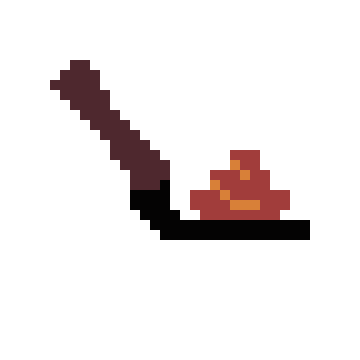

# Day 001

#### 1. 一些废话

开始学像素画～（呱唧呱唧

之所以喜欢像素画，除了易于入门不需要会控笔的童子功外，一个很重要的原因就是觉得其他板绘方式是图形工程师努力模仿物理世界的结果，而像素画则是碳基对硅基的致敬；还有一个原因大概是我是坚定的矢量厨（？。

今日入门教程是 [开始画像素画 #1 \[saint11像素宝典\]](https://www.bilibili.com/read/cv1735452?spm_id_from=333.999.0.0)。

 

#### 2. 作业

这张骷髅图让我非常自豪的是画了重击后的颅骨裂缝，感觉画的还挺像的。

宝剑的白色高光惨遭画布淹没。

还是人体工学铲子.jpg 因为实在不会画铲子所以努力画了 shit，おかげで还是被妈妈一眼认出来了。

 

#### 2. 思考

零基础的弊病第一天就暴露出来了：光影稀烂。和教程中的例图相比，我完全没想到 16 * 16 的空间中也可以画写实风格的渐变。当然了，就算给我 1023 * 1024 的画布我也画不出这种光影。一百天稍微补好这个课可能还是能做到的吧。大概。
