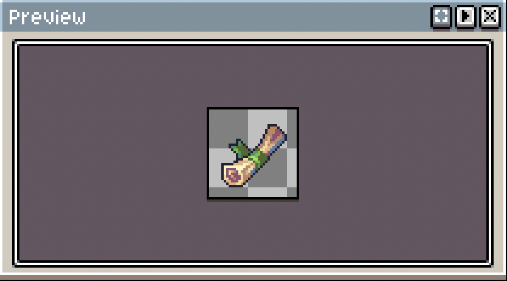

# Day 002

#### 1. 一些废话 

今天临摹的是公众号 “教你画像素画” 的第 220 期[每周分享](https://mp.weixin.qq.com/s/OimH2Wg9g7lupFc1Fzed7g) 中杂物素材中的……卷纸？以及第一次上手才知道，原来临摹不是像素级复刻，虽然今天还是数像素照抄了……

 

#### 2. 作业

能看出来外部线条还是非常干脆的，包括右面的连续性单像素线条（中间布凸起部分）为两像素，以及左面的竖直两像素 - 单像素 - 水平两像素的转换。外轮廓有助于从背景中突出物体，而内部如补和纸的轮廓则由颜色代替，节省空间 + 避免画面显得脏。

但是画完了看完缩略图才搞明白为什么会有这样的高光：坐下是纸边缘的部分，并且这边缘似乎有一点翘起。确实，如果不画边缘突出 “卷” 的感觉的话会看上去像一根木棒。

但作者到底是如何把光暗用蓝色 + 六种颜色表现出来的，感觉如果是我自己画的话可能效果还不如把一张照片压缩成马赛克效果好。用彩色来表示明暗让画面看上去非常漂亮，但为什么要用选择蓝色？

即使在原大缩略图上，这抹蓝色看上去也非常显眼：

如果换成我自己画时可能会选的保守点的颜色，那整体看起来确实有点单调。

此外总觉得这个明暗不大对的样子，底部真的会比内部更暗吗？毕竟有漫反射存在。于是换成了大图觉得实在很诡异的浅粉（卷心颜色漂白版），但缩略图效果意外地好：

考虑到一般用冷色调来表示暗，想要色彩不单调的话，似乎除了蓝色也没有其他特别好的选择了。

 

#### 3. 思考

囫囵吞枣地翻完了一遍  *Pixel Logic - A Guide to Pixel Art*, 对里面介绍的次级像素、反锯齿等部分感受到了一点小小的萌新震撼。人手画颜色过渡，甚至还是动画中不同帧的颜色过渡，这得多好的美术功底啊；当真的有那个能力的时候，大概又会觉得这么做很烦吧（？