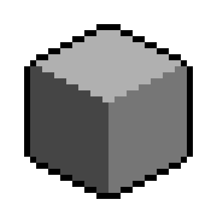
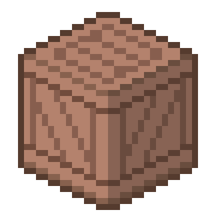
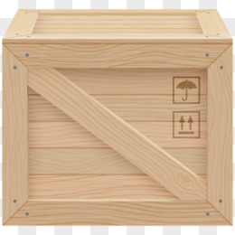
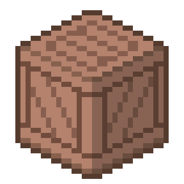

# Day 003

#### 1. 一些废话 

今天临摹（照抄）的是 [【正经课堂-像素教程篇3】小白的练习方向](https://www.bilibili.com/video/BV1q7411M7bX/?spm_id_from=333.999.0.0&vd_source=15cd815b42f684a493bf9d50fa1f770d) 中的轴测投影部分。

 

#### 2. 作业

首先自己画了个立方体：

充满了不对称的丑，并且看上去就像个圆角立方体。

但很奇怪的是，能感觉到这个木箱是这样的结构：

但为什么侧面部分横纹比竖纹深？然后改了个横竖纹同色版本的：

父上：第一个好看。

母上：第二个好看。

美术好难啊。

 

#### 3. 思考

用我的钛合金狗眼看出了原图左侧面和右侧面不同的明暗似乎是直接叠了一个图层，而不是上的不同的颜色。

