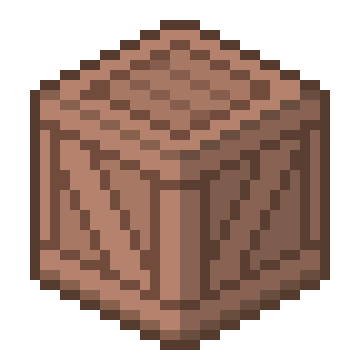

# Day 003

#### 1. 一些废话 

今天临摹（照抄）的是 [【正经课堂-像素教程篇3】小白的练习方向](https://www.bilibili.com/video/BV1q7411M7bX/?spm_id_from=333.999.0.0&vd_source=15cd815b42f684a493bf9d50fa1f770d) 中的轴测投影部分。

 

#### 2. 作业

首先自己画了个立方体：

充满了不对称的丑，并且看上去就像个充气的圆角立方体。

但很奇怪的是，能感觉到这个木箱是这样的结构：

但为什么侧面部分横纹比竖纹深？然后改了个横竖纹同色版本的：

父上：第一个好看。

母上：第二个好看。

美术好难啊。

不过，再仔细看这个实物木箱，如果按照同级别的同深浅的话，基本上除了顶部中间两条都得画这么深了。然后适当地添加了一点阴影颜色。感觉这个箱子越来越骨感了。

 

#### 3. 思考

用我的钛合金狗眼看出了原图左侧面和右侧面不同的明暗似乎是直接叠了一个图层，而不是上的不同的颜色。顺便直线工具真的好爽。顺便我发现就算到了像素画我还是不会用什么路径啦曲率钢笔啦之类的可怕的东西。

