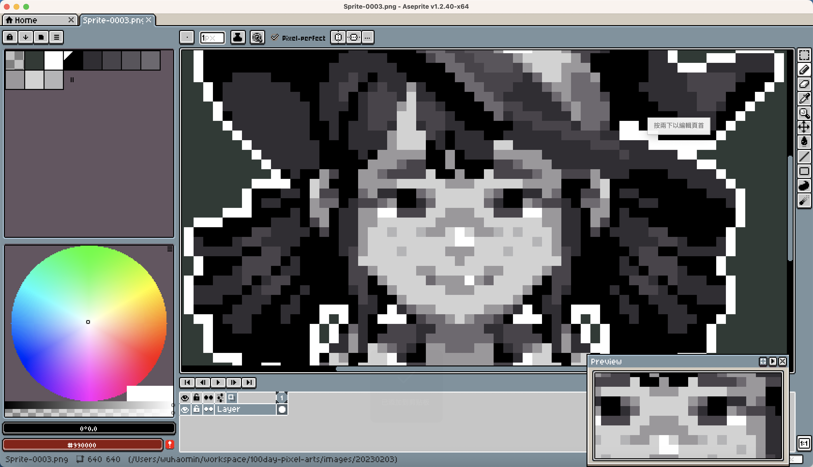

# Day 004

#### 1. 一些废话 

今天临摹（照抄）的是 A 站 Rex Cat 绘制的[头像](https://www.artstation.com/artwork/XBn4bl)。

 

#### 2. 作业

 

#### 3. 思考

除了脸上的雀斑和背景，加上黑白作者一共只用到了八种不同的灰色：

帽子的尖角部分 + 带子，就凑齐了上述全部的八种颜色：

其实本来想画完帽子就放弃来着的。当时找图的时候主要目的就是学一下人家怎么用不同的颜色表现明暗，而线条内部的渐变对我来说简直是自带加密，完全看不明白。然而被这张图击中心巴，以至于上手画了才发现线条内部的渐变也是有的。但因为画完帽子后发现剩下的部分除了刘海全能复制粘贴，就一鼓作气再衰三竭地画完了。

帽子尖角部分有两个区域高光，而靠后的尾部的高光颜色是靠前的高光颜色的较深的部分…… 嘛感觉这个适合反复看，就不在这里班门弄斧分析了。或许什么都想分析出公式反而是我的思维方式有误？感觉这些临摹的作品更适合加入武器库，需要反复看反复分析，而不能指望一遍就学会。

 

#### 3. 彩蛋

