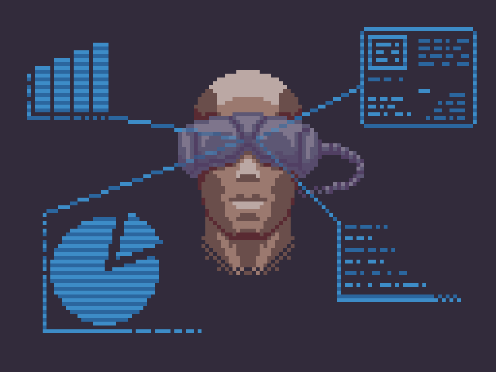
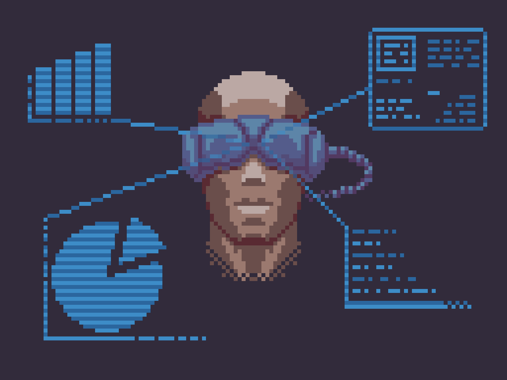
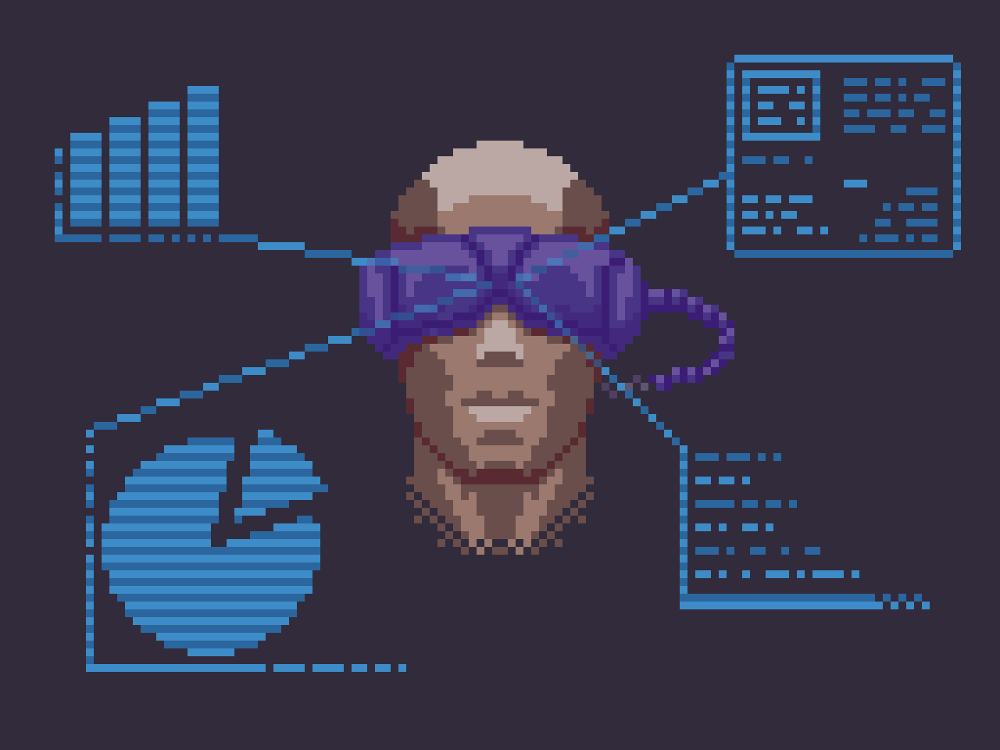
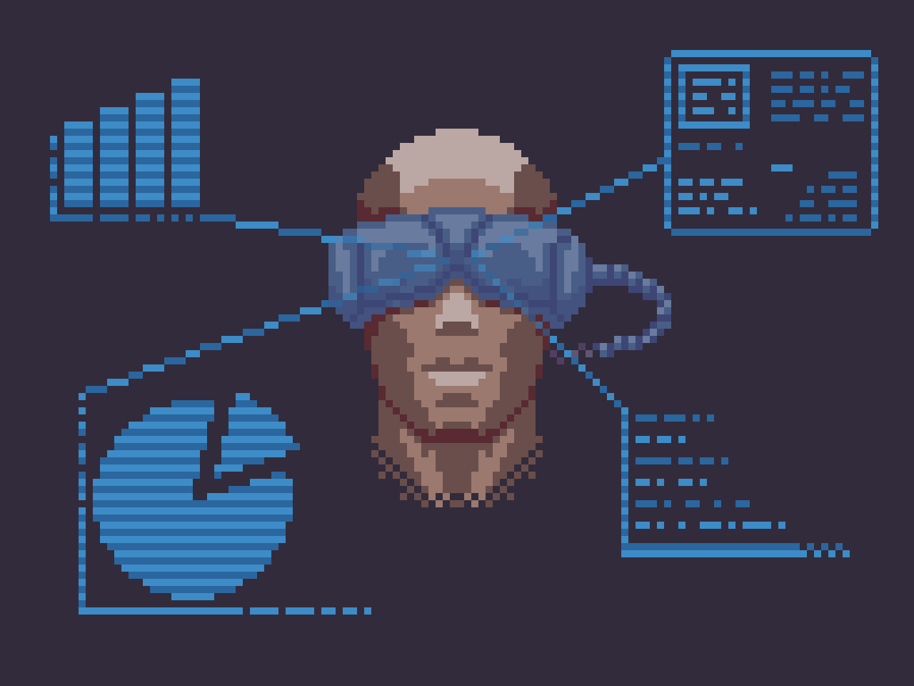
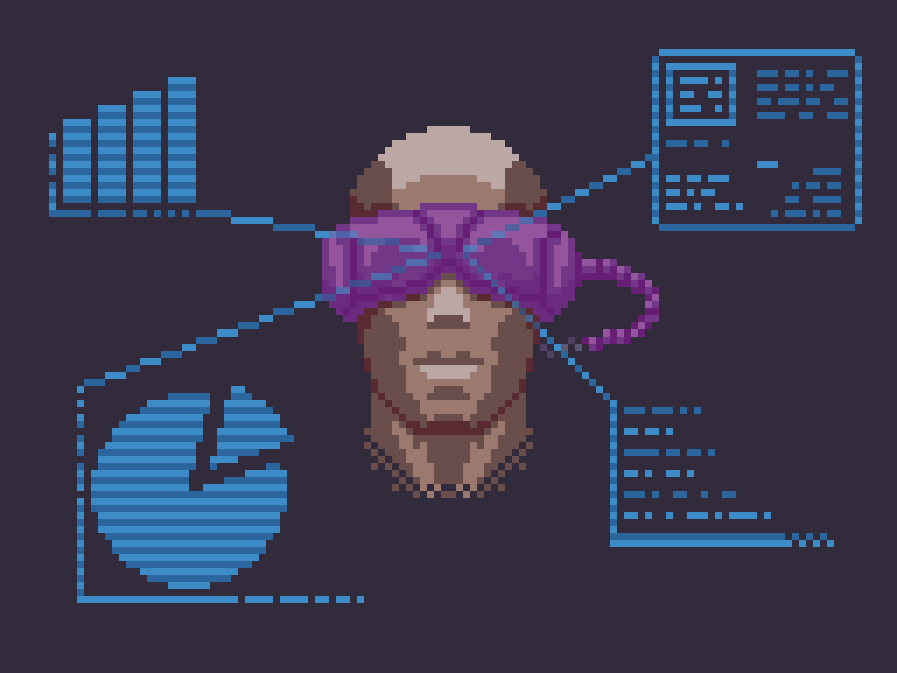
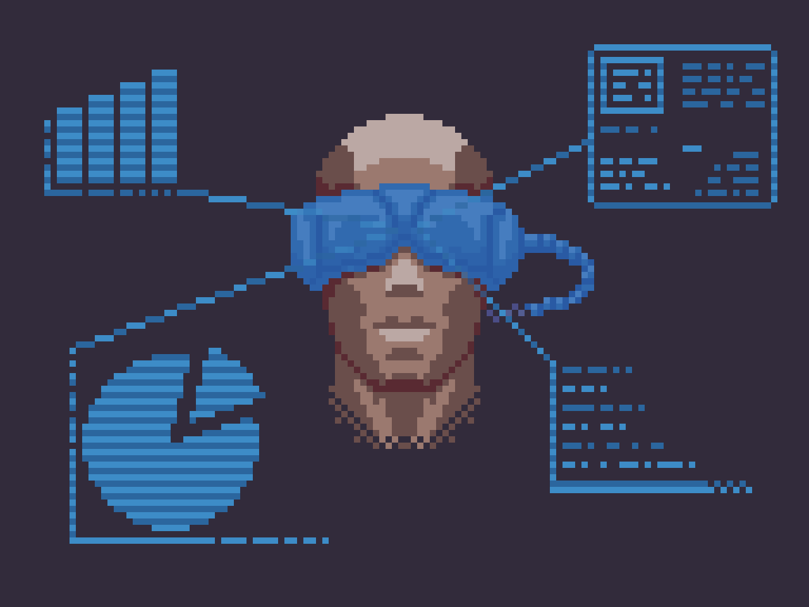
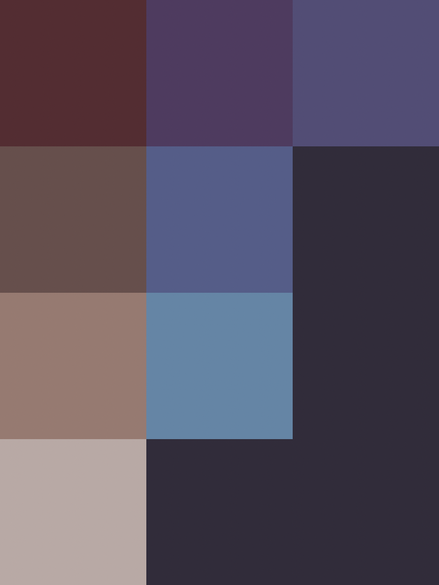
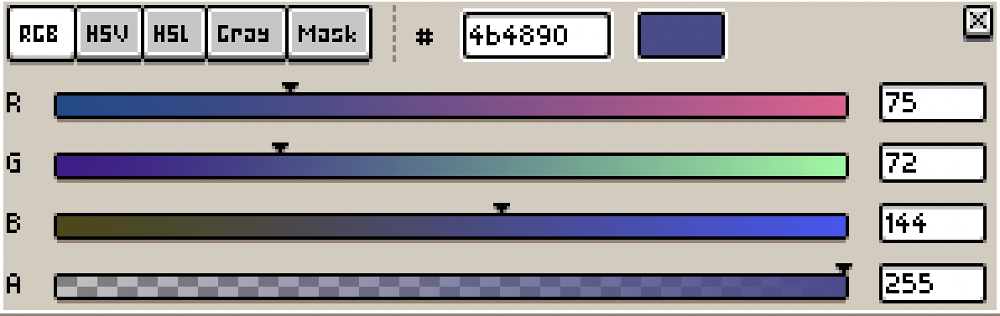

# Day 006

#### 1. 一些废话 

今天临摹（照抄）的是 A 站 Jonathan "Dulcahn" Dodd 绘制的[AR](https://www.artstation.com/artwork/KO5kKr)。我真的好喜欢这位老师的画风，感觉之后的临摹中这位老师的作品还会多次登场。

 

#### 2. 作业

眼镜部分被半透明蓝色图层蒙住版：

眼镜部分老实上色版：

和原版作品相比，几种图表延长线在人脸上的部分的颜色没有仔细调整。此外让我感到困惑的是，明明一样半径的正圆为什么我的和作者画的边缘有微妙的不同？感觉作者把圆削了一些小锯齿，这里我同样没有处理。作画真是一件精细的活啊。

 

#### 3. 思考

虽然在 Day 5 的记录中因为感觉不知何时才能上手画自己的作品而感到焦虑，当时还想着第二天的练习一定要自己画一个黑键的法杖出来，但真的要画的时候大眼瞪小像素还是不知如何下手。牙牙学语也得是在足够积累之后，而现在自己连像素画这门语言都谈不上熟悉，心急也没有用。

一开始我以为眼镜部分是由头部的颜色 + 某种颜色的半透明图层组合而成。但这让我相当疑惑，深棕浅棕加上其他颜色后难道能组合出看上去如此鲜丽的蓝色吗？蓝色不是原色吗？然后我硬着头皮试了试：

(alpha, r, g, b) = (84/255, 0, 0, 255):

如果把颜色向左上的青或右下的洋红靠近，那么颜色会变得更灰或更紫。

靠近青（0381ff）：

靠近品红（8308ff）：

这和我仅有的一点色彩知识并不相悖。不透明度调高更接近蓝色的话，确实会变得鲜亮，但明暗变化会变得非常不明显：

(alpha, r, g, b) = (143/255, 3, 0x81, 0xff):

仍不信邪的我决定把皮肤和眼镜的颜色分别挑出来，找找什么颜色加减计算器之类的。

根据 [iOS开发之像素Compositing](https://www.cnblogs.com/huahuahu/p/iOS-kai-fa-zhi-xiang-suCompositing.html):

> 设顶层颜色用RGB表示是(𝑟𝑠,𝑔𝑠,𝑏𝑠,𝛼𝑠), 底层颜色用RGB表示是(𝑟𝑑,𝑔𝑑,𝑏𝑑,𝛼𝑑)，则最终显示颜色 Rr = 𝑟𝑠⋅𝛼𝑠+(1−𝛼𝑠)⋅(𝑟𝑑⋅𝛼𝑑)

假设蒙版不透明度为 50%，则计算由第一行第一个变换至第一行第二个所需的中间颜色：

> 0.5 * 0x59 + 0.5x = 0x52, 0.5 * 0x2a + 0.5y = 0x39, 0.5 * 0x32 + 0.5z = 0x61
> 
> 解得 (0x4b, 0x48, 0x90)

即：

可以想见，上图色板左下角的颜色蒙上 50% 不透明度的这个紫色后会变成这样：

安详.jpg 于是老老实实用正确的颜色把眼镜重新画了一遍。眼镜和皮肤的颜色搭配得如此和谐，这不禁让我再次惊讶于画师对色彩的掌控力。

 

#### 4. 进一步思考

搜索混色算法的时候一些死去的图形学知识开始攻击我。知乎问题 [两个RGB向量的每个分量相乘的物理含义是什么？](https://www.zhihu.com/question/312214132) 一位匿名用户的回答让我有些在意："大多数都是搞 graphics 在这么用，少部分搞 CV 的也这么用，搞 color science 的没人会这么用。"

