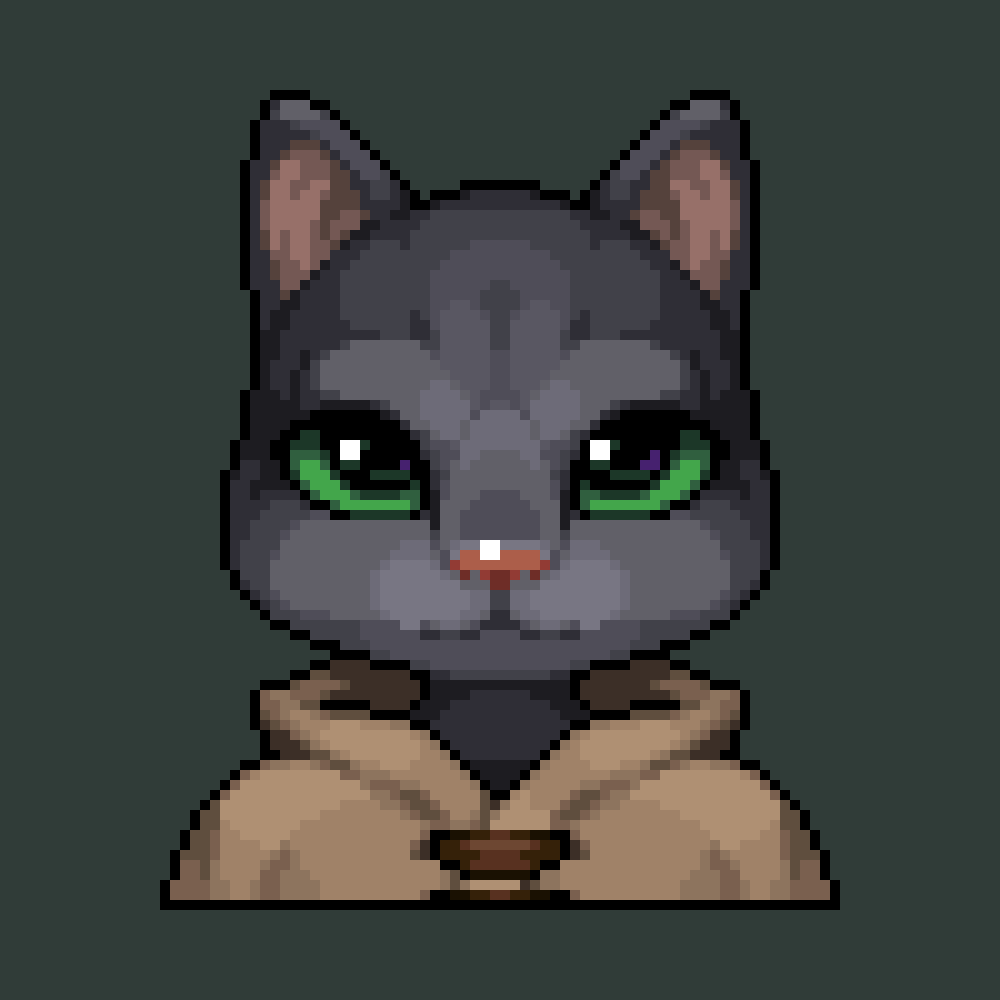
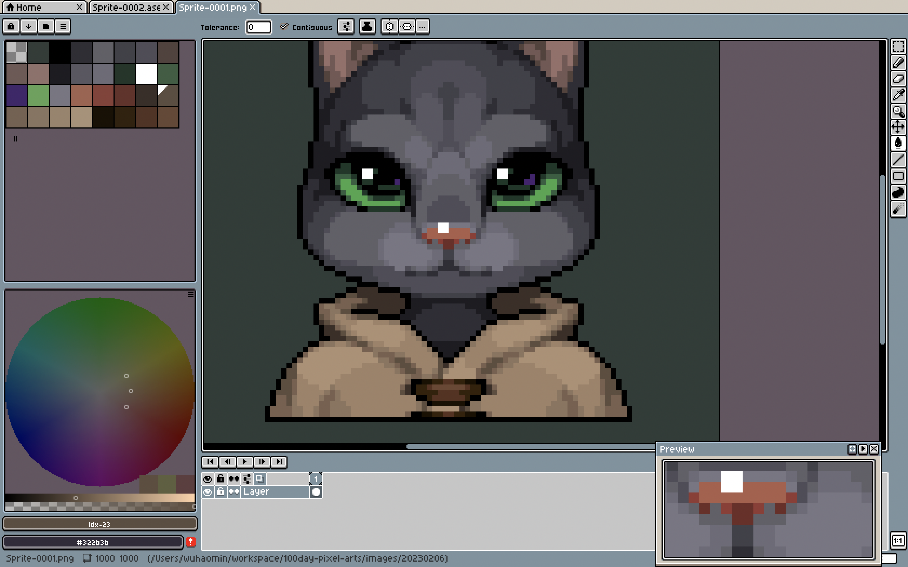
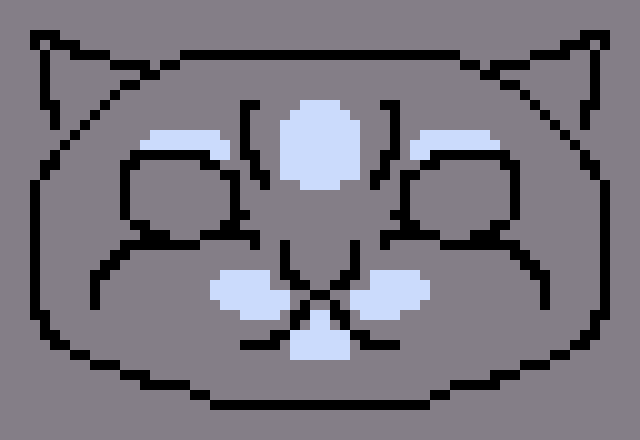

# Day 007

#### 1. 一些废话 

今天临摹（照抄）的是 A 站 Nashor Kim 绘制的[猫猫](https://www.artstation.com/artwork/3qmmgA)。本来想画一只蓝猫一只无毛对比用，比如说蓝猫毛的感觉比较重，而无毛强调了皮肤的褶皱。然后发现果然还是时间有限超出能力范围了。

 

#### 2. 作业

注意这个瞳孔里深绿和紫色的色块，缩小了离远了看真的仿佛渐变，好漂酿。以及我看到这张图的时候第一反应是脸部色块好明显，好抄。结果画衣服差点把我画吐。看看这色板里五彩斑斓的棕色：

这不借助什么照片一键转像素之类的辅助工具真的画的出来吗？这真的不是大佬在炫技吗？

 

#### 3. 胡言乱语

虽然猫猫本来就长得像小婴儿很可爱，但这里的画法淡化了猫猫的下巴，瞬间感觉 XP 点都被抹消了。回来给哈士奇画玉照的话，一定要强调他骨骼突出的小下巴：

放一张和小阿比胡搅蛮缠的照片：

