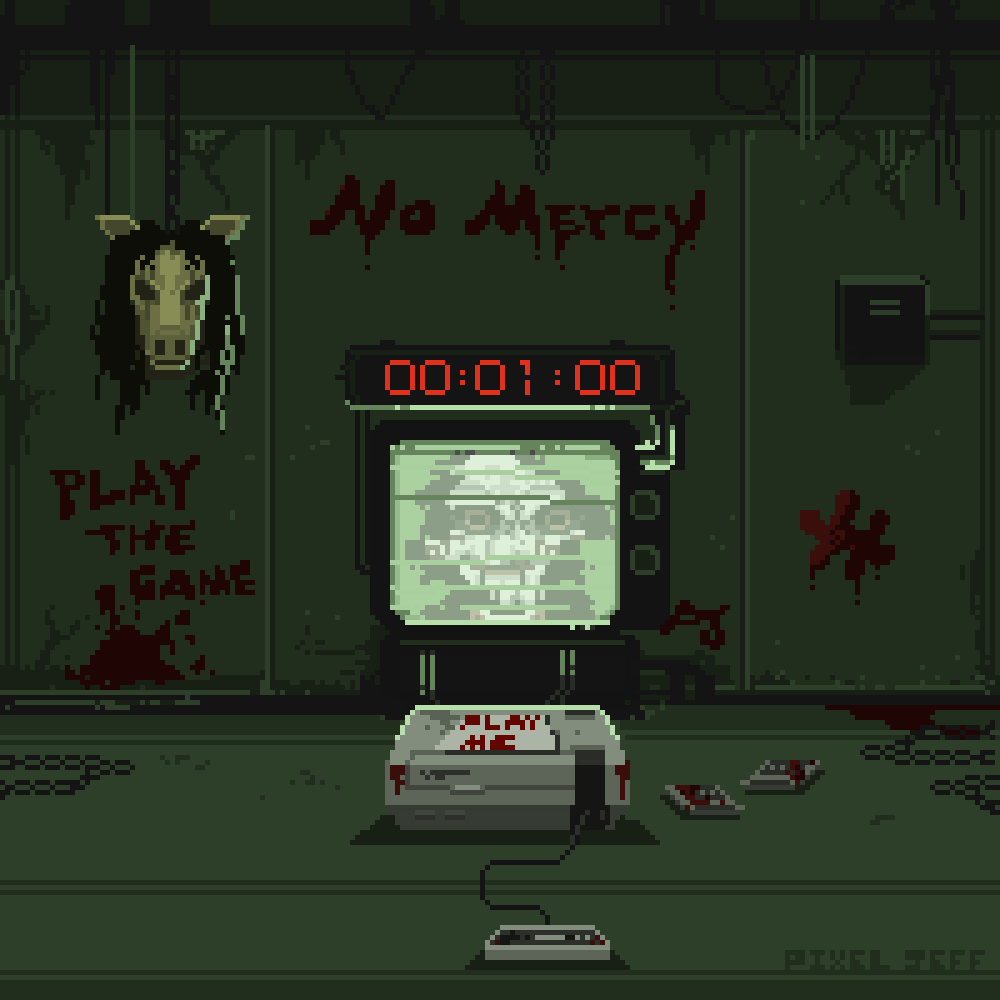
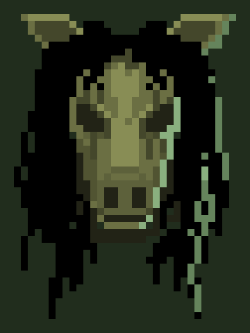

# Day 008

#### 1. 一些废话 

Time to 做大作业。

今天临摹（照抄）的是 A 站 Pixel Jeff 绘制的[电锯惊魂](https://www.artstation.com/artwork/lQlWa)。又是一位宝藏 freelancer 画师。

原 GIF 是 200 * 200 像素的，但实际布局疏密有致，动画效果也做的并不复杂。知识点大概是表现模糊时人像的漂移？

 

#### 2. 作业

先画了马面。这个头发实在是很飘逸，被电视光照亮的部分看上去很像暗绿色的锁链，甚至感觉有点帅是什么鬼。

 

#### 3. 思考

又到了思考目的为何的时候了。我想像素画大概完全没法满足画本子的需求；做游戏的话，虽然很难说在没有定下需求的时候便确定自己的学习目标，但无论如何我有想做成游戏的点子，有试水游戏开发的动机，但完全没有“啊，我要作为主美向世界展示我的创意”的想法。图形工程师确实有必要对美术流程有基本的了解，如果对作画细节有把握、对实际存在的需求有感知就更好了，但这些都是入门阶段能够完成的任务，仅从这个目标来说，之后的练习边际效应递减得会相当厉害。而美术无论如何是少不了练习的，逃过了笔触逃不过色彩，逃过了细节逃不过写意。相比学新知识的兴奋，练习总是枯燥的；万万没想到竟然从这个角度也能得出人生若只如初见的结论。

嘛明天画电视机。
